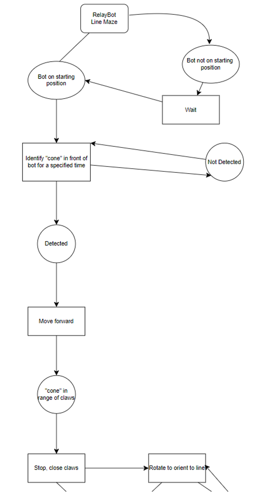
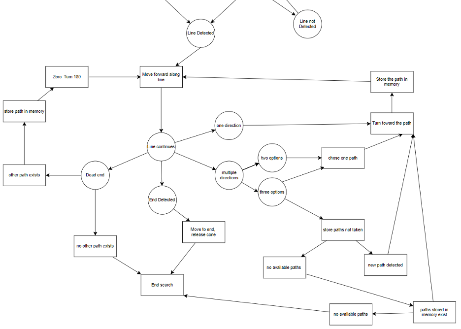

# Line Maze Follower

Line Maze Follower is one of the specialized robots for RelayBot project. The code that controls this robot is written in C++ programming language for Arduino Nano, using PlatformIO in Visual Studio Code.

## Table of Contents
- Requirements
- Installation
- Configuration
- How It Works

## Requirements
- [Visual Studio Code](https://code.visualstudio.com/download)
- [PlatformIO](https://platformio.org/install/ide?install=vscode)
- Arduino Nano AT MEGA 328 
- Integral Neopixle LED’s 
- Rotation Sensors (LM393 Opto-Interrupter) 
- InfraRed Line Sensors 
- Sonar Sensor (HCSR04) 
- 2 Motors 
- Bread-Board
- PCB “Back-Bone” 
- Servo Motor with Integral “Gripper” 
- Bluetooth Wireless Serial Module 
- Power Bank 
- USB Cable 
- H bridge Motor Driver 
- 3 Onboard Push-Buttons 
- 2 Switches 
- Red, Yellow, Green LED’s 
- Robot04 Chasis 

## Installation
- Download Zip file from Github
- Open the folder in Visual Studio Code

## Configuration
- Turn the switches on Arduino Nano off
- Connect Arduino Nano to PC using USB cable
- Verify the port is correctly chosen
- Compile and upload the code
- Reset Arduino Nano

## How It Works
The robot waits until it is placed on the starting position. Then it will try to identify the object in front of it. After detecting the object, the robot moves forward. When the object is within the range of its claws, the robot stops and its claws close. Then the robot tries to detect the line. After detecting the line, the robot moves forward along the line. Here, we have four possibilities: one direction, multiple directions, dead end, and end detected. 
- If end is detected, it moves to end, releases the cone, and the search ends here. 
- When there is one direction, it turns toward the path, stores the path in memory, moves forward along the line, and again checks the line for the four possibilities. 
- When there are multiple directions, the robot chooses one path, and the rest is the same as one direction. If it is not the correct path, the robot goes back to where it was and takes another path. 
- If the path taken ends in a dead end, the robot stores the path in memory, turns 180 degrees, moves forward along the line, and checks for the four possibilities again. 

